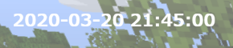

realtime clock
===============



配信画面に現在時刻を表示します。

## 使い方
1. [zipファイルをダウンロードします](https://github.com/PRiMENON/realtime-clock/archive/master.zip)
1. 適当なフォルダに展開します
1. `clock.html` を OBS などの配信ソフトのブラウザソースとして開きます
1. 完了

## 初期設定

ゲーム画面を背景に表示すると、黒文字は見ずらいので白文字になっています。  
そのために、何も表示されていないように見えます。

## カスタマイズ
### 日本語の年月日で表示したい
```
toFormat('yyyy-LL-dd HH:mm:ss')
👇
toFormat("yyyy'年'LL'年'dd'日' HH'時'mm'分'ss'秒'")
```

### 時計の背景色をつけたい
```
<div id="time" class="style"></div>
👇
<div id="time" class="style style__background"></div>
```

色の指定は下記です。  
デフォルトは黒色になっていて、透明度を`.7`（0.7の省略指定）にしてあります。`1`が不透明で、`0`に近ければ透明になります。
```
background: rgba(0,0,0,.7);
```

## 使用ライブラリ
luxon.js という時刻表示ライブラリを使用しています。
* [Luxon](https://moment.github.io/luxon/) - MIT License

## 動作確認ブラウザ

* Google Chrome
* Mozilla Firefox
* Microsoft Edge

## ライセンス
MIT License
